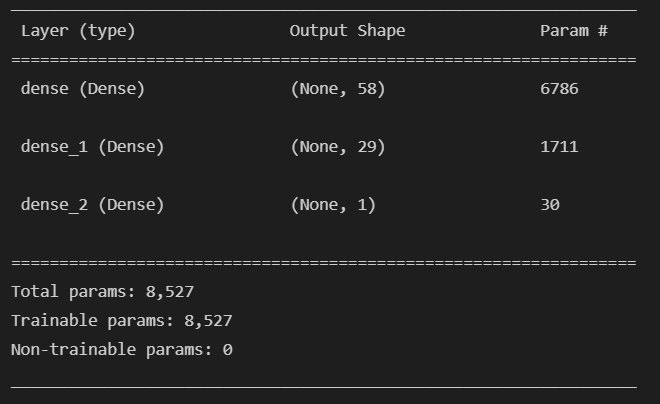
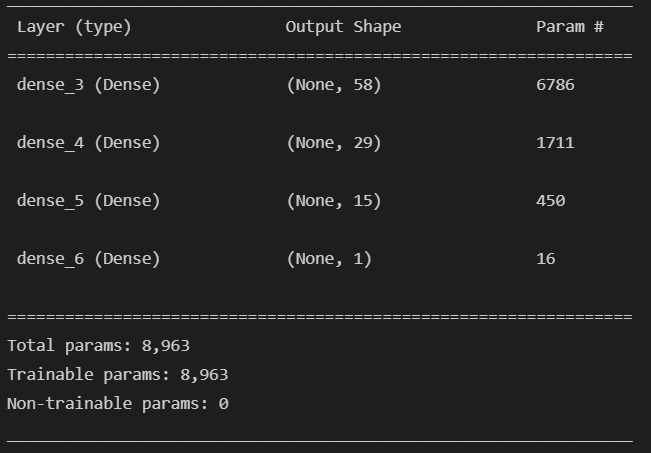
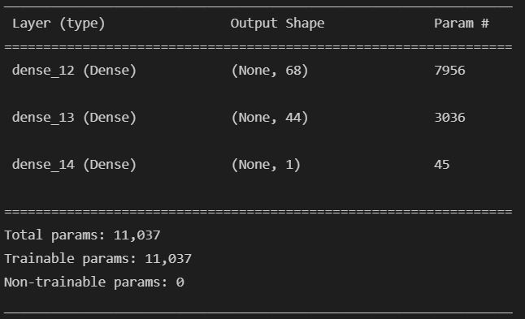

# Deep Learning Venture Capital Success Predictor

This repo contains an example of a deep learning binary classifier model that predicts whether a venture capital applicant will become a successful business.  The example highlights pre-processing techniques including the encoding of categorical variables; creation of training and test datasets; and standard scaling.  It also includes model optimization techniques for the number of layers and number of neurons.

## Technologies

The application uses the following technologies:

- [Python 3.7](https://www.python.org)
- [pandas](https://pandas.pydata.org/pandas-docs/stable/index.html)
- [Scikit-learn](https://scikit-learn.org/stable/index.html)
- [Tensorflow](https://www.tensorflow.org/)
- [Keras](https://keras.io/about/)
- [Jupyter Lab](https://jupyter.org/)

## Installation Guide

```python

pip install --upgrade pip
pip install numpy
pip install pandas
pip install tensorflow
pip install jupyterlab

```

## Overview of the Analysis

### Objective

The objective of this deep learning predictive modeling is to create a model that correctly classifies the success of a venture capital applicant based on input data.

### Approach

The approach taken included the following six steps:

1. **Read the data**: A CSV file with 34,299 applications was provided with the following features: EIN, NAME, APPLICATION_TYPE, AFFILIATION, CLASSIFICATION, USE_CASE, ORGANIZATION, STATUS, INCOME_AMT, SPECIAL_CONSIDERATIONS, and ASK_AMT along with an IS_SUCCESSFUL indicator classifiying it as a success.
2. **Encode categories**: Several features contained categories. OneHotEncoder from the sklearn library was used to numerically encode these columns.
3. **Split the data into training and testing sets**: The data was split into training and testing sets with 75% being allocated to training and the remaining 25% allocated to testing.  Splits were accomplished using scikit-learn's train_test_split object.  Values were scaled using the StandardScaler.
4. **Fit the model**: A *Sequential* model was constructed with an input layer consisting of 116 features, 2 hidden layers, and a one neuron output layer.  The hidden layers contained a neuron amount = (*previous layer* + output layer neurons) // 2.  Hidden layers used the *relu* activation while the output layer used *sigmoid*. The model was compiled with an *adam* optimizer and *binary_crossentropy* loss with *accuracy* metric.  These were appropriate for a classification model. The model was fit with scaled training data and *y* labels.
5. **Evaluate the model**: The model was evaluated for accuracy using the *evaluate* method of the fit Sequential model.
6. **Tune model**: Two alternatives were created that varied the number of layers, the number of neurons per layer, and the hidden layer activation. 

## Results

The evaluation of the three (original + two alternatives) yielded the following results

**Original Model**

2 hidden layers, relu activation
268/268 - 0s - loss: 0.5568 - accuracy: 0.7307 - 403ms/epoch - 2ms/step




**Alternative Model 1**

3 hidden layers, relu activation
268/268 - 1s - loss: 0.5586 - Accuracy: 0.7291 - 564ms/epoch - 2ms/step




**Alternative Model 2**

2 hidden layers, softmax activation
268/268 - 1s - loss: 0.5523 - Accuracy: 0.7313 - 1s/epoch - 4ms/step



## Summary

Overall, the model and its alternatives are approximately 73% accurate.  It is likely that the number of features can be reduced to improve accuracy in future refining sessions.

## Contributors

- Jacob Rougeau

## License

MIT
